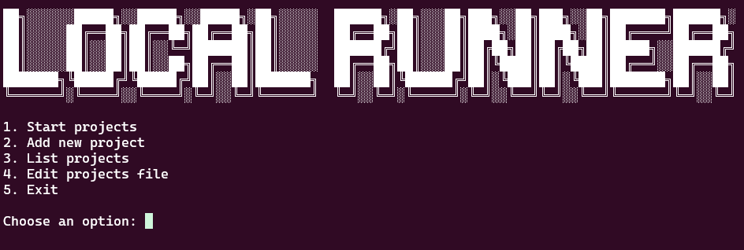

# Local Runner

Local Runner is a simple project to quickly start projects in your local environment. Just register the project by providing the name, the absolute path, and the initialization command, and you're done!

Say goodbye to the manual work of navigating through multiple directories to execute specific commands.

## Preview



## Pré-requisite
- Bash: The script was developed to be executed on systems with Bash installed.

## Installation

Clone the repository:
```bash 
$ git clone https://github.com/iamThiagoo/local-runner.git
$ cd local-runner
```

Give execution permission to the script:

```bash 
$ chmod +x index.sh
```

Run the script:

```bash 
$ ./index.sh
```